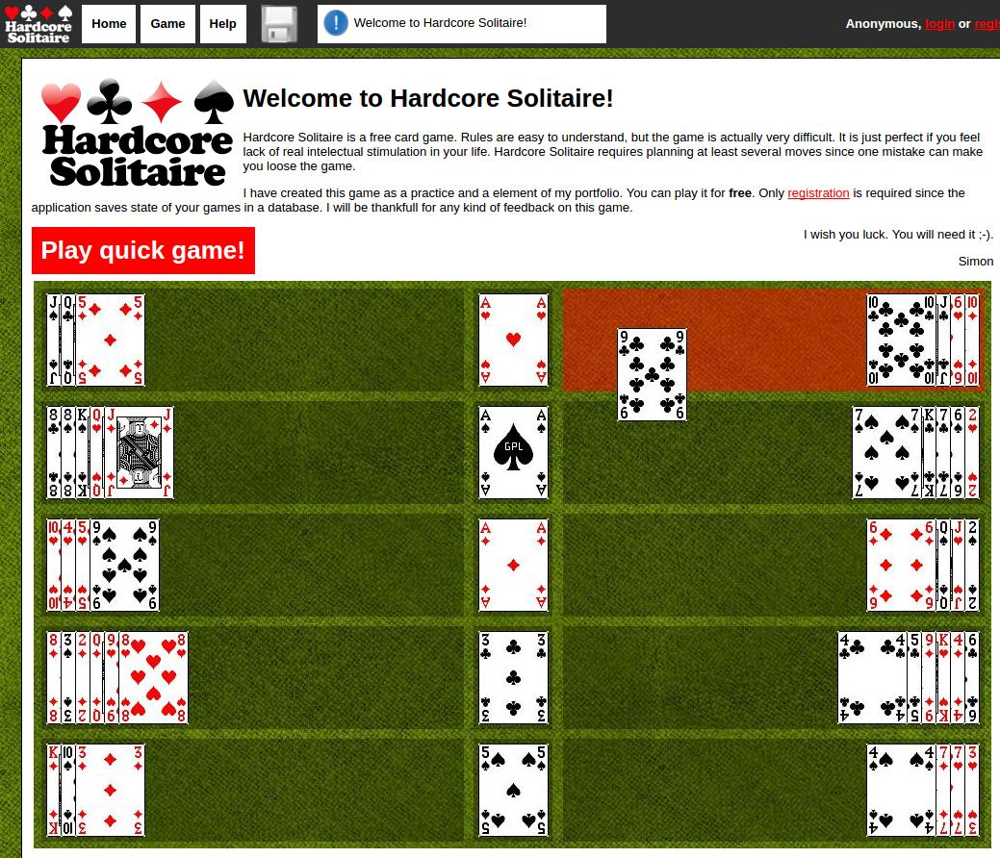
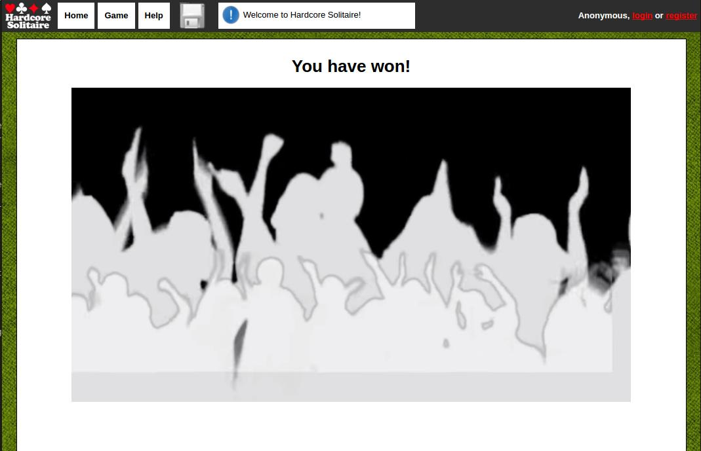

# Hardcore Solitaire


A very demanding version of a solitaire game. 
This is one of my old projects that I decided to publish.
It is one of the most difficult yet satisfying solitaire games.
To win the game you don't need any luck - you just need to be able to think several moves in advance.

# About the game

## Screenshots

Start of the game:



When you win:



## Overview
Hardcore Solitaire is one of the most challenging solitaire games. Maybe the most difficult one.
The game does not depend on luck because all cards are uncovered at the start of the game and winning the game depends only on your ability to plan all the moves.

## Basic rules
The rules are very simple: 
* You can only move one card at a time. 
* You can place the given card only on a free stack or on a card that has the same color but a value greater by one.
* There is one "special" spot at the bottom of the boards where you can put only onee card.
* The game ends when you manage to place all cards on ases. 

You'll find detailed instruction within the game.

# The technical stuff
## How to install

This is a simple Django project - you need to install Python 2.7 and Django library. Then the simplest way is to run:

```
python manage.py runserver
```

Or please read Django instructions to configure CGI. Some operations (including registration and logging in require configured database - please read related Django documentation.

## Technolgies used:
* Python language
* Django
* HTML
* jQuery

